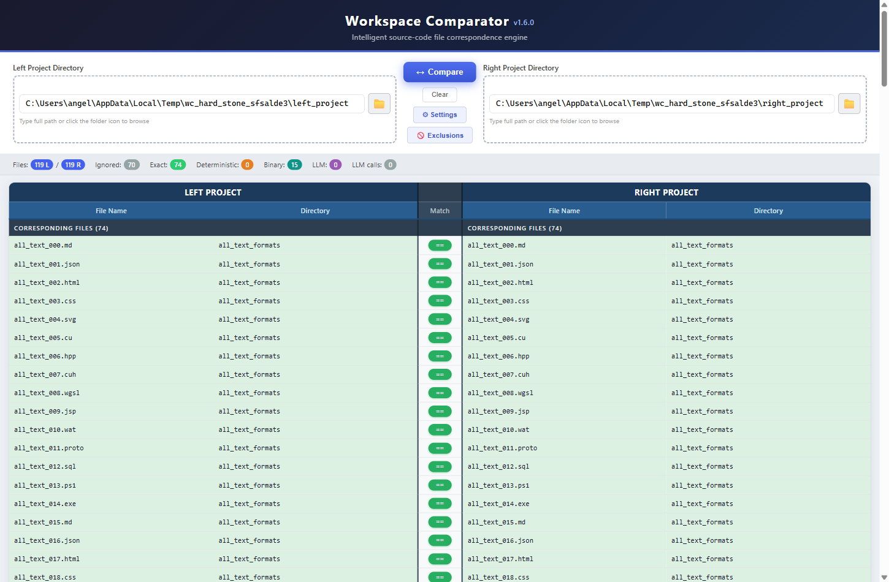
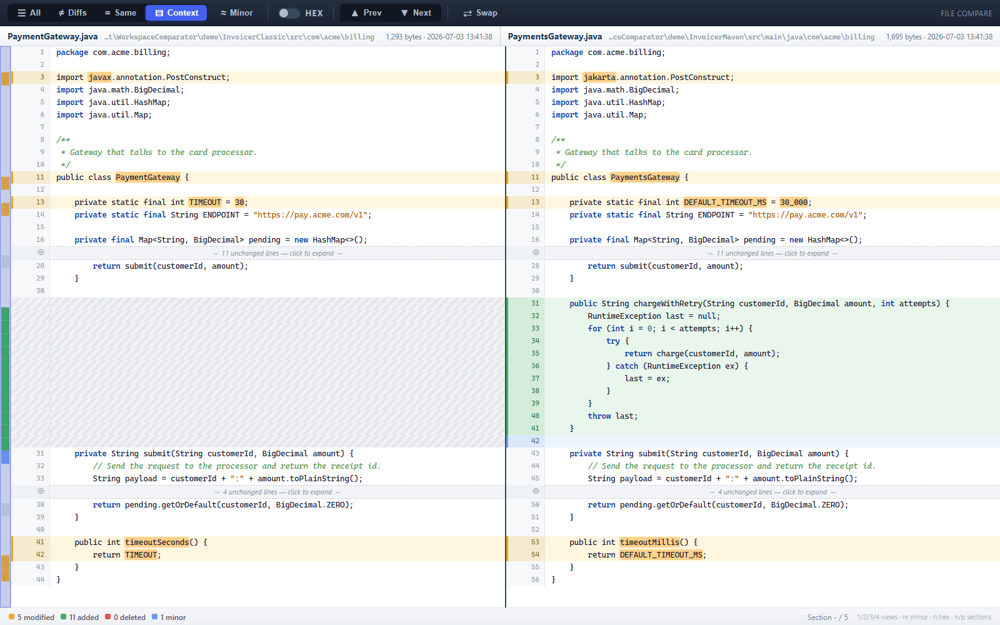
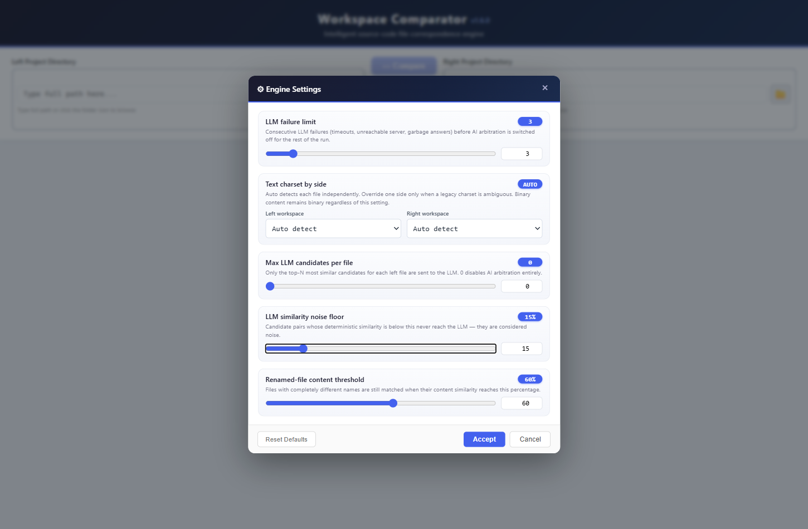

<div align="center">

# 🔍 Workspace Comparator

### *"We migrated project A into project B… which files are actually the same?"*

A local web tool that finds the **file correspondences** between two complete
workspaces — surviving renames, moves, extension changes and build-system migrations — with a
Beyond Compare-style diff viewer and an optional local **AI referee**. 🧠

<p align="center">
  
  
  
  
</p>
<p align="center">
  
  
  
</p>



</div>

## ✨ What you get

- 🧩 **4-phase matching engine** — exact path → same name → fuzzy name → pure content. It catches files that were **renamed** (`StringHelper.java` → `TextUtils.java`) or **moved** (`src/` → `src/main/java/`).
- 🏷️ **Honest pills** on every match: `==` identical · `~=` only comments/whitespace changed · `!=` really different.
- 🧾 **No silent drops and no unsupported extensions** — every real file is content-classified and accounted for. Explicit exclusions and `.` / `..` aliases appear in a dark-gray **Ignored Files** section when **Show excluded** is checked.
- 🤖 **Content-aware AI arbitration** *(optional)* — ambiguous text pairs get a dynamic Ollama system prompt based on detected language/format and charset, even when an extension is custom, absent, or misleading. No Ollama running? The tool falls back to deterministic matching.
- 🔢 **True binary files, compared in hex** — actual bytes, not extensions, decide binary status. Native binaries are matched deterministically by exact filename (directory path is the tie-break clue; AI never receives bytes) and open in a locked colored hex viewer.
- 🔤 **Charset and newline aware** — per-file auto detection handles UTF-8, UTF-16/32 and legacy text, with optional left/right charset overrides. `CRLF`, `LF`, and `CR` are normalized before matching and diffing.
- ⚙️ **Settings** & 🚫 **Exclusions** dialogs tune matching, select per-side charsets, and control exclusions. Large file/folder pattern lists scroll independently, and **Show excluded** hides or restores ignored table rows without rerunning the comparison.

## 🧭 How v1.6.0 treats every filesystem entry

| What the bytes contain | Matching behavior | Viewer behavior |
|---|---|---|
| Text, with any known, unknown, misleading, or missing extension | Deterministic structural comparison first; bounded dynamic LLM arbitration when needed | Charset-aware aligned text diff with word highlighting |
| Native binary bytes | Deterministic exact-name matching, byte identity first and directory similarity as tie-breaker; never sent to the LLM | Locked side-by-side hex with per-byte highlighting |
| Explicitly excluded file or file under an excluded directory | Not matched; retained in the response and shown in the dark-gray **Ignored Files** table when **Show excluded** is checked | Intentionally non-openable while ignored |
| Synthetic `.` and `..` aliases | Accounting rows shown with other ignored entries when **Show excluded** is checked; never treated as files | Intentionally non-openable |

There is no extension allowlist and no "unsupported extension" state. A `.md`, `.cu`, `.hpp`,
`.wgsl`, `.jsp`, `.jar`, `.war`, `.o`, custom `.whatever`, or extensionless file is always
loaded. The bytes decide whether it follows the text pipeline or the native-binary pipeline.

### Dynamic text understanding

For text candidates, `text_profile.py` scores the actual content before consulting the suffix.
Known language and format profiles include C/C++, CUDA, Java, C#, assembly, Rust, Go, Python,
JavaScript/TypeScript, PHP, Perl, shells, HTML/XML, Markdown, JSON/YAML/TOML, SQL, shaders,
WebAssembly text and many more. Unknown text gets a generic token/declaration/data-key analysis.

Each LLM candidate receives a dynamically generated Ollama **system message** with both detected
content profiles, confidence, filename-extension hints, effective charsets, and format-specific
comparison guidance. Thus Java source named `Something.exe` is described as Java text with a
misleading `.exe` hint. Native binary content is rejected before this path and never reaches AI.

### Charset and newline behavior

Auto mode detects Unicode BOMs, common BOM-less UTF-16/32, UTF-8, Windows-1252, and Latin-1 per
file. The Settings dialog can override the left and right workspaces independently with UTF-8,
UTF-16/32 variants, Windows-1252, Latin-1, ASCII, Shift-JIS, GB18030, Big5, or EUC-KR. Overrides
never bypass binary detection.

All decoded line endings canonicalize before comparison. `HELLO\r\n`, `HELLO\n`, and
`HELLO\r` are therefore the same logical text and produce `==` with no changed diff rows.

## 🚀 Get it — the easy way

Go to **[Releases](../../releases)** → download **`WorkSpaceComparator.exe`** → double-click. Done. 💅

No Python, no pip, no installer — one self-contained file. It starts a private server and
opens your browser at `http://127.0.0.1:9000/` all by itself. Close the console window when
you're finished.

## 🖱️ How to use it

**1.** Pick your two folders (type the paths or browse 📁) and hit **Compare**.
**2.** Read the verdict: green joined rows correspond, red rows lack a counterpart, and dark-gray rows are explicit exclusions or directory aliases when **Show excluded** is enabled.
**3.** **Double-click a matched or unmatched row** to open the side-by-side or single-file viewer. Ignored rows deliberately stay inert:

<div align="center">

</div>

Corresponding lines **face each other** even when line numbers drift, changed **words** are
highlighted inside the line, unchanged runs fold away, and the minimap gives you the whole
file at a glance. Tune matching and each side's charset with the ⚙ Settings dialog:

<div align="center">

</div>

> 🧪 **Try it right now** — the repo ships a tiny demo migration: compare
> `demo/InvoicerClassic` against `demo/InvoicerMaven` and watch every match type appear —
> including a pair of binary logos that light up the **BIN** tag and the hex viewer.

## 🛠️ Run from source

```powershell
pip install -r requirements.txt
python -m playwright install chromium  # one-time browser binary for tests
python manage.py runserver        # → http://127.0.0.1:8000
```

Optional AI referee: `ollama serve` with the `glm-5.2:cloud` model pulled.

The browser and Django application stay local. AI requests go only to the configured Ollama
endpoint at `127.0.0.1`; because the default model name ends in `:cloud`, Ollama itself may use
its cloud service and network according to your Ollama account/configuration. Disable LLM
arbitration with `max_llm_per_file: 0` for deterministic-only operation.

The compare API accepts the same controls used by the GUI:

```json
{
  "left_dir": "C:/work/original",
  "right_dir": "C:/work/migrated",
  "settings": { "max_llm_per_file": 3, "content_sim_threshold": 60 },
  "exclusions": { "files": ["*.tmp"], "dirs": ["generated"] },
  "charsets": { "left": "auto", "right": "cp1252" }
}
```

Excluded files remain in `ignored_left` / `ignored_right`; effective settings, exclusions and
charsets are echoed in `stats`.

## 🧱 Visible hard-stone test

```powershell
python HardStoneVisiblePlaywrightTest.py
python test_browser.py
```

The hard-stone command opens a real visible Chromium window, creates a 234-file dataset, and runs
50 screenshot-backed checks covering all-extension text, misleading extensions,
UTF/legacy charsets, CRLF/LF equality, native binary hex, independently scrollable exclusion lists,
the **Show excluded** visibility switch, dot directories, extensionless files, and `.` / `..` ignored rows. The second command is a portable
six-check headless smoke test that falls back to the bundled demo when external MAE fixtures are absent.

## 📦 Build the release exe

```powershell
python build.py                   # full build → dist/WorkSpaceComparator.exe
python build.py --skip-deps       # faster rebuild
```

The script runs PyInstaller in one-file mode, then **smoke-tests the exe** — boots it and
verifies the embedded UI is current — before declaring victory. 🏁 Upload the result to a
GitHub Release and your users are one double-click away.

---

<div align="center">

Made with 💜 by **Ángela López Mendoza** · 📧 [angela@xaiht.org](mailto:angela@xaiht.org)

*MIT licensed — compare boldly, migrate fearlessly.*

</div>
