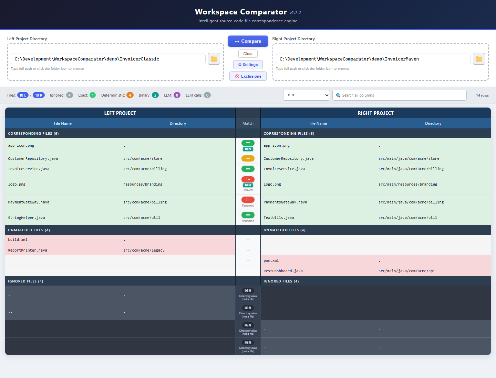
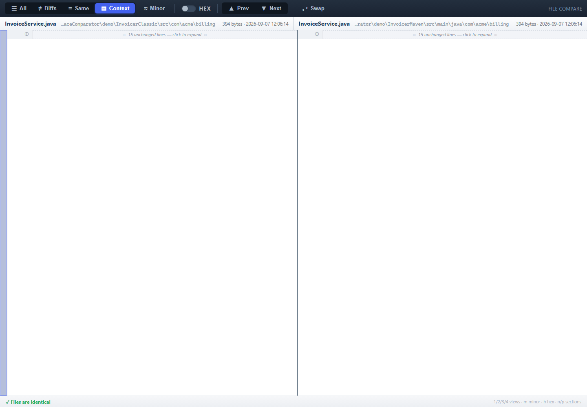
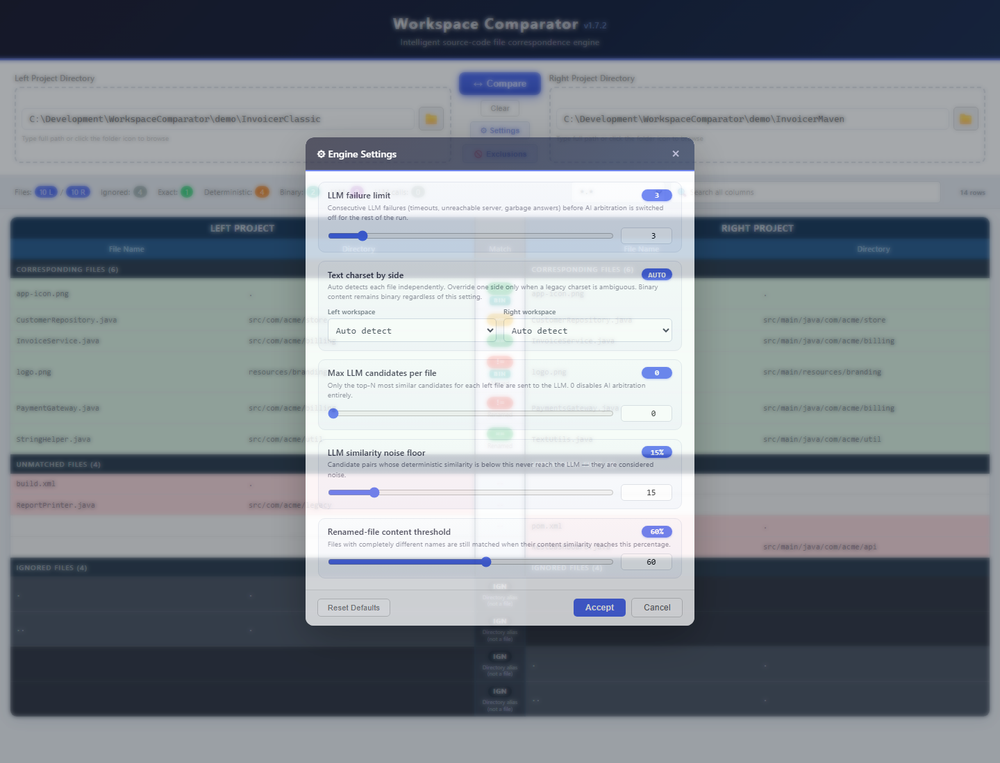

<div align="center">

# 🔍 Workspace Comparator

### *"We migrated project A into project B… which files are actually the same?"*

A local web tool that finds the **file correspondences** between two complete
workspaces — surviving renames, moves, extension changes and build-system migrations — with a
Beyond Compare-style diff viewer and an Ollama-backed **AI referee** for ambiguous text pairs. 🧠

<p align="center">
  
  
  
  
</p>
<p align="center">
  
  
  
</p>



</div>

## ✨ What you get

- 🧩 **4-phase matching engine** — exact path → same name → fuzzy name → pure content. It catches files that were **renamed** (`StringHelper.java` → `TextUtils.java`) or **moved** (`src/` → `src/main/java/`).
- 🏷️ **Honest pills** on every match: `==` identical · `~=` only comments/whitespace changed · `!=` really different.
- 🧾 **No silent drops and no unsupported extensions** — every real file is content-classified and accounted for. Explicit exclusions and `.` / `..` aliases appear in a dark-gray **Ignored Files** section when **Show excluded** is checked.
- 🤖 **Content-aware AI arbitration** *(important for ambiguous matches)* — ambiguous text pairs get a dynamic Ollama system prompt based on detected language/format and charset, even when an extension is custom, absent, or misleading. Deterministic fallback keeps the app usable without Ollama, but it can lose correspondences for difficult moved, renamed, or structurally changed text files.
- 🔢 **True binary files, compared in hex** — actual bytes, not extensions, decide binary status. Native binaries are matched deterministically by exact filename (directory path is the tie-break clue; AI never receives bytes) and open in a locked colored hex viewer.
- 🔤 **Charset and newline aware** — per-file auto detection handles UTF-8, UTF-16/32 and legacy text, with optional left/right charset overrides. `CRLF`, `LF`, and `CR` are normalized before matching and diffing.
- ⚙️ **Settings** & 🚫 **Exclusions** dialogs tune matching, select per-side charsets, and control exclusions. Large file/folder pattern lists scroll independently. **Show excluded** starts checked, persists with the patterns, and hides or restores ignored table rows without rescanning or rerunning the comparison.
- 🔎 **Instant result navigation** — the stats bar builds an extension selector from both projects (`*.*` shows everything, including a dedicated no-extension option). Matched rows use OR semantics, so selecting either side's extension retains a cross-extension correspondence. Case/diacritic-insensitive token and fuzzy search scans every visible column, highlights coincident characters, and scrolls the first hit to the top; Enter and Shift+Enter move through hits.

## 📌 Current v1.7.1 capability baseline

| Area | Current behavior |
|---|---|
| Discovery | Recursively accounts for every real file, including dot directories, dependency/build output, extensionless names, and unknown or misleading suffixes |
| Content routing | Samples bytes first; readable Unicode/legacy content follows the text pipeline and native bytes follow the binary pipeline, independent of extension |
| Text correspondence | Exact path, same-name, fuzzy-name, and content-only phases combine deterministic structure with bounded Ollama arbitration for ambiguous candidates |
| Binary correspondence | Never uses the LLM; same-name candidates are ranked by whole-file byte identity and then directory similarity, while renamed binaries remain unmatched |
| Complete reporting | Matched, unmatched, explicitly excluded, and synthetic `.` / `..` accounting rows are all retained; **Show excluded** controls only rendering |
| Result exploration | Dynamic extension filtering, cross-extension OR retention, all-column folded/fuzzy search, character highlighting, hit navigation, and status sorting run without a new comparison |
| Text comparison | Charset-aware, newline-normalized aligned rows, best-line pairing, changed-word highlighting, minor-change handling, context folding, syntax coloring, section navigation, and minimap |
| Byte comparison | Locked hex for native binaries, optional hex for text, 16-byte rows, byte highlights, aligned gaps, complete-file identity, and explicit 128 KiB render truncation |
| Reliability | Per-run text caching, bounded LLM candidate sets, noise-floor pruning, an LLM failure circuit breaker, diff cost guards, and a v1.7.1 early exit for empty or binary-only remaining right-side candidates |

### Release lineage

- **v1.7.1:** the Phase 3b content-only sweep stops before eager left-file reads when no free text
  candidate remains on the right. Empty, exhausted, and binary-only destination pools avoid useless
  content work while preserving exactly the same result.
- **v1.7.0:** added the dynamic extension selector and all-column fuzzy search/highlight navigator.
- **v1.6.0:** made file treatment content-first for every extension, added charset-aware decoding and
  newline equality, protected binary-only deterministic/hex handling, and made exclusions visible.

## 🧭 How v1.7.1 treats every filesystem entry

| What the bytes contain | Matching behavior | Viewer behavior |
|---|---|---|
| Text, with any known, unknown, misleading, or missing extension | Deterministic structural comparison first; bounded dynamic LLM arbitration when needed | Charset-aware aligned text diff with word highlighting |
| Native binary bytes | Deterministic exact-name matching, byte identity first and directory similarity as tie-breaker; never sent to the LLM | Locked side-by-side hex with per-byte highlighting |
| Explicitly excluded file or file under an excluded directory | Not matched; retained in the response and shown in the dark-gray **Ignored Files** table when **Show excluded** is checked | Intentionally non-openable while ignored |
| Synthetic `.` and `..` aliases | Accounting rows shown with other ignored entries when **Show excluded** is checked; never treated as files | Intentionally non-openable |

There is no extension allowlist and no "unsupported extension" state. A `.md`, `.cu`, `.hpp`,
`.wgsl`, `.jsp`, `.jar`, `.war`, `.o`, custom `.whatever`, or extensionless file is always
loaded. The bytes decide whether it follows the text pipeline or the native-binary pipeline.

### Dynamic text understanding

For text candidates, `text_profile.py` scores the actual content before consulting the suffix.
Known language and format profiles include C/C++, CUDA, Java, C#, assembly, Rust, Go, Python,
JavaScript/TypeScript, PHP, Perl, shells, HTML/XML, Markdown, JSON/YAML/TOML, SQL, shaders,
WebAssembly text and many more. Unknown text gets a generic token/declaration/data-key analysis.

Each LLM candidate receives a dynamically generated Ollama **system message** with both detected
content profiles, confidence, filename-extension hints, effective charsets, and format-specific
comparison guidance. Thus Java source named `Something.exe` is described as Java text with a
misleading `.exe` hint. Native binary content is rejected before this path and never reaches AI.

### Charset and newline behavior

Auto mode detects Unicode BOMs, common BOM-less UTF-16/32, UTF-8, Windows-1252, and Latin-1 per
file. The Settings dialog can override the left and right workspaces independently with UTF-8,
UTF-16/32 variants, Windows-1252, Latin-1, ASCII, Shift-JIS, GB18030, Big5, or EUC-KR. Overrides
never bypass binary detection.

All decoded line endings canonicalize before comparison. `HELLO\r\n`, `HELLO\n`, and
`HELLO\r` are therefore the same logical text and produce `==` with no changed diff rows.

### Matching and AI guardrails

Each file can be consumed by at most one match. The engine runs stronger evidence before broader
evidence: exact relative path, same-name binary/text handling, fuzzy filenames, then the Phase 3b
content-only sweep for renamed text. Files still free after those passes are reported as unmatched.

Deterministic comparison strips format-appropriate comments, neutralizes string literals,
normalizes whitespace, compares tokens, and blends declaration/key overlap when useful. Ambiguous
text candidates can reach Ollama only after deterministic ranking and a configurable similarity
floor. Calls are capped per left file, stop after repeated failures, and fall back cleanly when
Ollama is unavailable. Native binary content is excluded from every AI path.

### Exclusion rules

Patterns support `*` and `?`. Plain patterns match basenames anywhere in a tree; patterns containing
`/` match forward-slash relative paths, and a matching folder pattern applies to descendants. Enter
multiple patterns with commas or semicolons, disable a saved pattern without deleting it, and use
the independently scrollable file/folder lists for large configurations. Accept commits the draft;
Cancel leaves the previous configuration untouched.

The server still returns every excluded file in `ignored_left` / `ignored_right` with its reason.
**Show excluded** is stored with the browser-side exclusions and can hide or restore those dark-gray
rows from the current response without rescanning. The ignored statistics never change with this
presentation switch.

## 🚀 Get it — the easy way

Go to **[Releases](../../releases)** → download **`WorkSpaceComparator.exe`** → double-click. Done. 💅

No Python, no pip, no installer — one self-contained file. It starts a private server and
opens your browser at `http://127.0.0.1:9000/` all by itself. Close the console window when
you're finished.

> **The executable includes Workspace Comparator, but it does not include Ollama, an Ollama
> account/subscription, or model access.** Complete AI-assisted matching requires the setup below.

## 🖱️ How to use it

**1.** Pick your two folders (type the paths or browse 📁) and hit **Compare**.
**2.** Read the verdict: green joined rows correspond, red rows lack a counterpart, and dark-gray rows are explicit exclusions or directory aliases when **Show excluded** is enabled.
**3.** Use the stats-bar mini-form to select an extension or search all five table columns. `*.*` restores the complete report; the counter shows visible rows or search-hit position. Press Enter/Shift+Enter to move forward/backward through highlighted hits, or Escape/× to clear.
**4.** Use **Exclusions** to maintain file and folder patterns. Each pattern list has its own scrollbar; Accept commits the draft, while Cancel discards it. Toggling **Show excluded** and accepting re-renders an existing result immediately.
**5.** **Double-click a matched or unmatched row** to open the side-by-side or single-file viewer. Ignored rows, when shown, deliberately stay inert:

<div align="center">

</div>

Corresponding lines **face each other** even when line numbers drift, changed **words** are
highlighted inside the line, unchanged runs fold away, and the minimap gives you the whole
file at a glance. Tune matching and each side's charset with the ⚙ Settings dialog:

<div align="center">

</div>

> 🧪 **Try it right now** — the repo ships a tiny demo migration: compare
> `demo/InvoicerClassic` against `demo/InvoicerMaven` and watch every match type appear —
> including a pair of binary logos that light up the **BIN** tag and the hex viewer.

### Result-table controls

| Control | Behavior |
|---|---|
| Extension selector | `*.*` restores all rows; `[no extension]` selects suffixless names; a matched pair stays visible when either side has the selected extension |
| Search box | Searches all five rendered columns after extension and excluded-row filtering; folds case/diacritics and supports literal, token-AND, and bounded in-order fuzzy matching |
| Enter / Shift+Enter | Moves forward/backward through highlighted result rows; the first hit is automatically placed at the top of the viewport |
| Escape / clear button | Clears the current table search and highlights |
| Double-click **Match** | Toggles status order (`different`, `minor`, `identical`) and then restores the original left-anchored order |
| Double-click a result row | Opens a matched pair or an unmatched single file in a new tab; ignored rows have no open action |

Filtering, searching, sorting, and **Show excluded** are presentation-only operations. They re-render
the stored result and never mutate paths, matching order, API statistics, or backend settings.

### File-comparison controls

| Control | Behavior | Shortcut |
|---|---|---|
| All / Diffs / Same / Context | Selects complete, changed-only, equal-only, or three-line contextual display; Context is the default | `1` / `2` / `3` / `4` |
| Minor | Treats whitespace-only modifications and blank additions/deletions as equal | `m` |
| HEX | Opens cached `hexdump -C`-style byte comparison; optional for text, checked and locked for binary | `h` |
| Prev / Next | Jumps between contiguous difference sections | `p` / `n` |
| Swap | Exchanges left/right files and their charset settings | button |
| Minimap | Displays change distribution and the current viewport; click or drag to navigate | pointer |

Click a collapsed unchanged-lines separator to expand that run. Both panes scroll together, and
every visible row has a corresponding row or explicit hatched gap on the other side. Binary rows
show 16 bytes plus ASCII, with changed bytes highlighted. Files larger than 128 KiB per side receive
a visible truncation notice, while equality still comes from a complete byte-for-byte file check.

Unmatched files open on their original side with the opposite pane empty. Text remains syntax
colored, native binary content opens as locked hex, and text can still be switched to hex manually.

## 🛠️ Run from source

```powershell
pip install -r requirements.txt
python -m playwright install chromium  # one-time browser binary for tests
python manage.py runserver        # → http://127.0.0.1:8000
```

## 🧠 Required Ollama setup for complete matching

One of Workspace Comparator's most important correspondence mechanisms is LLM arbitration. The
deterministic engine resolves obvious pairs, but difficult same-name, fuzzy-name, and content-only
rename candidates can require the LLM to decide whether two files serve the same purpose. For the
intended full-quality workflow, install Ollama, sign in with a cloud-enabled account, subscribe for
adequate cloud usage, and make the configured model available before comparing complex workspaces.

### 1 · Install Ollama

Install [Ollama for Windows](https://ollama.com/download/windows). The native installer runs Ollama
in the background and exposes its local API at `http://127.0.0.1:11434`, which is the endpoint
Workspace Comparator calls. The application is supported on Windows 10 or later.

After installation, open a new PowerShell window and verify the CLI:

```powershell
ollama --version
ollama serve  # only when the Ollama tray/background service is not already running
```

Do not start a second `ollama serve` process if the desktop application already owns port 11434.

### 2 · Subscribe to Ollama and sign in

Create an Ollama account and choose a plan on the official [Ollama pricing page](https://ollama.com/pricing).
As of August 2026, Ollama lists Pro at **US$20/month or US$200/year billed annually**. Pricing and
limits belong to Ollama and may change, so confirm them on the linked page.

Ollama currently gives Free accounts light cloud usage, but Workspace Comparator uses
`glm-5.2:cloud`, which Ollama classifies as a **High Usage** model. Treat an **Ollama Pro
subscription as the recommended operational requirement** for repeated or complex workspace
comparisons: Pro currently includes larger cloud models, three concurrent cloud models, and 50x
the cloud usage of Free. Then connect the local installation to the subscribed account:

```powershell
ollama signin
```

Cloud models require account authentication. Local access to `127.0.0.1:11434` itself does not use
an API token; the signed-in Ollama installation authenticates its own cloud requests.

### 3 · Pull and verify the configured model

Workspace Comparator v1.7.1 is configured for one arbitration model:
[`glm-5.2:cloud`](https://ollama.com/library/glm-5.2). Pull its catalog entry, verify that Ollama
lists it, and run a quick prompt before starting a large comparison:

```powershell
ollama pull glm-5.2:cloud
ollama ls
ollama run glm-5.2:cloud "Return only the number 100"
```

The `:cloud` suffix means inference runs through Ollama Cloud rather than downloading the model's
full weights to your computer. Keep Ollama running while Workspace Comparator works. The app sends
ambiguous, content-sniffed text samples to the local Ollama API using its `/api/generate` endpoint;
Ollama then routes that model request to its cloud service.

### What happens without Ollama

The app deliberately fails soft: it continues with deterministic scoring when Ollama is missing,
signed out, out of usage, unreachable, or returns an invalid answer. That is a compatibility mode,
not equivalent matching coverage. Ambiguous files may remain unmatched, `LLM` matches may stay at
zero, and `LLM calls` may stop after the configured failure limit opens the circuit breaker.

Set **Max LLM candidates per file** to `0` only when deterministic-only operation is intentional.
Otherwise, keep the default of `3` and confirm the stats bar records LLM calls on a comparison that
contains genuinely ambiguous text pairs.

The compare API accepts the same controls used by the GUI:

```json
{
  "left_dir": "C:/work/original",
  "right_dir": "C:/work/migrated",
  "settings": { "max_llm_per_file": 3, "content_sim_threshold": 60 },
  "exclusions": { "files": ["*.tmp"], "dirs": ["generated"] },
  "charsets": { "left": "auto", "right": "cp1252" }
}
```

Excluded files always remain in the API's `ignored_left` / `ignored_right`; effective settings,
exclusions and charsets are echoed in `stats`. **Show excluded** is deliberately not an API input:
it is a presentation-only preference persisted in `localStorage["wcExclusions"].showExcluded`, so
hiding rows never changes scanning, matching, ignored counts, or the response payload.

## 🧱 Visible hard-stone test

```powershell
python HardStoneVisiblePlaywrightTest.py
python test_browser.py
```

The hard-stone command opens a real visible Chromium window, creates a 236-file dataset, and runs
60 screenshot-backed checks covering all-extension text, misleading extensions,
UTF/legacy charsets, CRLF/LF equality, native binary hex, independently scrollable exclusion lists,
the **Show excluded** visibility switch, dynamic extension filtering with cross-extension OR semantics,
fuzzy all-column search/highlighting, dot directories, extensionless files, and `.` / `..` ignored rows. The second command is a portable
six-check headless smoke test that falls back to the bundled demo when external MAE fixtures are absent.

## 📦 Build the release exe

```powershell
python build.py                   # full build → dist/WorkSpaceComparator.exe
python build.py --skip-deps       # faster rebuild
```

The script runs PyInstaller in one-file mode, then **smoke-tests the exe** — boots it and
verifies the embedded UI is current — before declaring victory. 🏁 Upload the result to a
GitHub Release and your users are one double-click away.

---

<div align="center">

Made with 💜 by **Ángela López Mendoza** · 📧 [angela@xaiht.org](mailto:angela@xaiht.org)

*MIT licensed — compare boldly, migrate fearlessly.*

</div>
